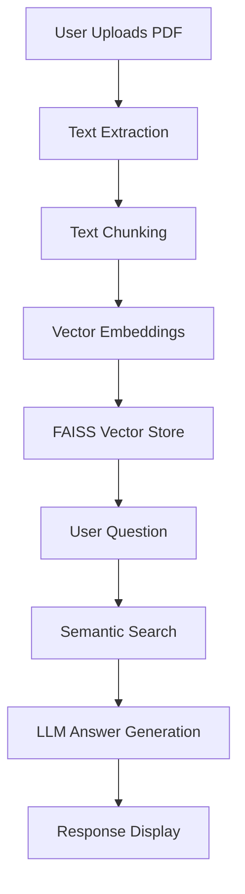

# AI Powered Insurance Policy Information  Chatbot


## 📌 Problem Statement
Insurance customers often struggle to find specific policy information in lengthy documents. This AI chatbot solves that by:
- Providing instant answers to policy-related questions
- Understanding natural language queries
- Extracting precise information from uploaded documents
- Maintaining privacy by processing documents locally

## 🎯 Features
- **Multi-Policy Support**: Handles health, auto, home, and life insurance documents
- **Document Intelligence**: Processes uploaded PDFs to create a searchable knowledge base
- **Precise Q&A**: Uses FLAN-T5 LLM to generate accurate, context-aware answers
- **Source Citation**: Shows exact document references for each answer
- **Privacy-First**: No data leaves your local machine
- **User-Friendly UI**: Simple Streamlit interface with document upload and chat

## 🛠️ Technical Implementation
### Core Components
| Component | Technology | Purpose |
|-----------|------------|---------|
| Document Processing | PyPDF2 | Text extraction from PDFs |
| Text Chunking | LangChain | Prepares documents for analysis |
| Embeddings | Sentence-Transformers | Converts text to numerical vectors |
| Vector Database | FAISS | Enables fast semantic search |
| Language Model | FLAN-T5 (via HuggingFace) | Generates human-like answers |
| UI Framework | Streamlit | Web interface for user interaction |


## 📦 Installation

1. Clone the repository:
```bash
git clone https://github.com/ashutoshgithubs/Insurance_Chatbot.git
cd Insurance_Chatbot
```
## 🧑‍💻 Colab-Specific Setup


```python
!pip install -q PyPDF2 langchain huggingface-hub sentence-transformers faiss-cpu

```
## System Architecture


<br><br>


# Acknowledgments  
Special thanks to:

HuggingFace for their open-source models

Google Colab for providing free compute resources

The LangChain community for their documentation